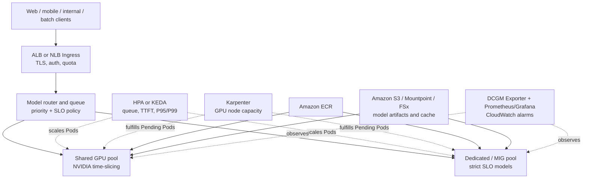

# Amazon EKS multi-model GPU sharing and SLO-driven inference

A reference design for placing low-duty-cycle inference services in a shared NVIDIA GPU pool while protecting latency-sensitive models with dedicated or MIG-backed capacity.

The design combines NVIDIA GPU time-slicing, explicit memory budgets, model routing, queue/SLO-driven Pod scaling, Karpenter node scaling, cold-start controls, and end-to-end observability.

## Decision first: shared or dedicated?

| Prefer a shared pool | Prefer dedicated GPU or MIG |
|---|---|
| Small models with low, intermittent, or non-overlapping traffic | Sustained high concurrency |
| Some latency variation is acceptable | Strict TTFT or P95/P99 SLO |
| Measured memory headroom exists | Long/unpredictable context or tight memory |
| Development, test, or degradable workloads | Critical or isolation-sensitive workloads |

Time-slicing advertises multiple schedulable replicas of one physical GPU. It does **not** partition GPU memory or guarantee a fixed compute fraction. A request for a logical replica is shared access, not a fractional GPU reservation.

## Architecture

## Anonymized lab baseline

An isolated EKS lab compared one 3B instruction model on a single A10G GPU:

| Scenario | Mean request latency | Single-stream rate | 10-way aggregate output rate |
|---|---:|---:|---:|
| One model, dedicated | 1.83 s | ~66.5 tokens/s | 481.98 tokens/s |
| Two models configured, neighbor idle | 1.96 s | ~67.5 tokens/s | 499.10 tokens/s |
| Two models active, combined | 3.90–4.71 s per model | ~31 tokens/s per model | 512.09 tokens/s combined |

Interpretation: the idle neighbor had little effect in this test. When both models were active, aggregate card throughput remained similar while per-request latency rose to roughly 2.1–2.6 times the dedicated baseline. This does not prove that time-slicing increases physical GPU capacity; it shows why admission must be based on real traffic overlap and tail-latency SLOs.

These values are a reference from one model, one GPU type, and one load shape—not a universal performance claim.

## Implementation path

1. **Profile candidates** — collect 1–2 weeks of QPS, concurrency, context length, TTFT, P95/P99, queue time, device memory, and KV-cache pressure.
2. **Create separate pools** — label/taint shared and dedicated GPU nodes; keep critical replicas across nodes.
3. **Enable time-slicing** — start with two replicas per GPU and restart the device-plugin DaemonSet during a maintenance window.
4. **Set memory budgets** — ensure model weights + peak KV cache + runtime overhead + safety margin remain below physical memory.
5. **Scale on service pressure** — use queue depth as a leading signal and latency as an SLO guardrail; let Karpenter add nodes for Pending Pods.
6. **Reduce cold start** — immutable ECR images, SOCI where applicable, VPC endpoints, model caching, warm capacity, readiness only after model warm-up.
7. **Load-test and fail safely** — test all-active traffic, long context, OOM, Pod restart, node loss, capacity shortage, and rollback to dedicated capacity.

## Example manifests

The `manifests/` directory is intentionally incomplete and contains placeholders. Review versions and APIs for the target cluster before applying:

- `time-slicing-config.yaml` — two logical replicas per physical GPU
- `shared-inference.yaml` — example shared workload and memory budget
- `priority-and-pdb.yaml` — priority and disruption protection
- `keda-scaledobject.yaml` — queue-driven scaling example
- `karpenter-nodepool.yaml` — separate shared/dedicated capacity intent

## Minimum observability

- GPU: utilization, device memory, temperature, power, ECC/Xid
- Kubernetes: Pending Pods, scheduling failures, restarts, node provisioning time
- Inference: QPS, running/waiting requests, queue time, KV-cache usage, tokens/s
- Experience: TTFT, inter-token latency, P50/P95/P99, timeout and error rates
- Cost: GPU hours, idle rate, cost per output token, SLO attainment

## References

- [Manage NVIDIA GPUs on Amazon EKS](https://docs.aws.amazon.com/eks/latest/userguide/device-management-nvidia.html)
- [Autoscale model inference on GPUs with Amazon EKS](https://docs.aws.amazon.com/eks/latest/userguide/ml-inference-autoscaling.html)
- [NVIDIA GPU Operator time-slicing](https://docs.nvidia.com/datacenter/cloud-native/gpu-operator/latest/gpu-sharing.html)
